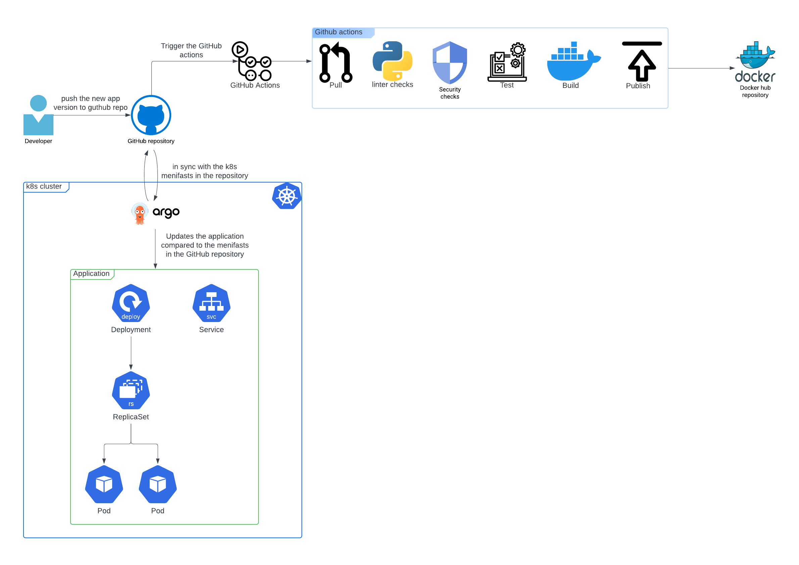

# CI/CD Project

## Overview

In this project, a CI/CD pipeline has been created for the continuous integration and continuous deployment of an application, as part of an automated process that begins when the developer updates the application.
It involves the utilization of GitHub Actions, Docker and Docker Hub for the integration, and ArgoCD which is running on a Kubernetes cluster for the deployment.

### Diagram explaining the project



## The CI/CD pipeline used in this project

### Python and Flask

The application used in this project is a simple web application written in python , built using the Flask web framework.

### Dockerfile and Docker Hub

In order to create a container that will run the application, we'll need a Dockerfile that will provide the instruction for its automated building.

A Docker Hub account will be used to host the Docker Image that we will create of the application.

### GitHub repository and Github Actions

A Github Repository is necessary in this project in order to host the python application script, the Dockerfile that is used to create a Docker Image, and the rest of the files that will be used further in the CI/CD process, like the deployment file for the Kubernetes cluster.

Once we have the files relevant for the application, before creating the image we will run several tests on the application using Github Action, to verify that the script is written properly, without any security weaknesses, and is running properly.

Once these tests are complete, Github Action will build the Docker Image with the python script and Dockerfile provided, using this command:

```
docker image build -t [dockerhub-username]/[application-name]:latest .     
```

The image created will then be pushed onto Docker Hub for hosting, using this command:

```
docker push [dockerhub-username]/[application-name]:latest
```


### Kubernetes cluster

For the deployment of our application, we'd need a Kubernetes cluster running. The deployment will create several pods from which the web application will run and will be accessible.

In this project a Kubernetes cluster would also be used to run Argo CD. To set up the Argo cluster, we'd first create a namespace for it, and then run its manifests, using these commands:

```
kubectl create namespace argocd

kubectl apply -n argocd -f https://raw.githubusercontent.com/argoproj/argo-cd/stable/manifests/install.yaml
```

In order to access the Argo CD UI, we'll have to port forward the server, in this case forwarding it to port 8080:

```
kubectl port-forward svc/argocd-server -n argocd 8080:443 --address='0.0.0.0' &
```

Once we navigate to http://localhost:8080 we can login using the default username "admin", and the password that is retrieved using this command:

```
kubectl -n argocd get secret argocd-initial-admin-secret -o jsonpath="{.data.password}" | base64 -d
```

### ArgoCD

Once we have the Argo cluster up and the UI set, the Docker Image hosted on Docker Hub, and the Kubernetes deployment files hosted on Github, we can set up the deployment of the application using Argo CD.

- In the Argo web UI, click on **+New App** to create a new application.
- Application Name: flask-app
- Project: default
- Sync Policy: Automatic
- Repository URL: https://github.com/sabkorm/ci_cd_project
- Revision: master
- Path: k8s
- Cluster URL: https://kubernetes.default.svc
- Namespace: default
- Click **Create** and then **Sync** to deploy the cluster with the application.


### Port Forward the Flask Application

After the application has been deployed via Argo, forward a local port to the Flask App service port:

```
kubectl port-forward svc/flask-app 8081:80 --address='0.0.0.0' &
```

Accesse the Flask App in your web browser, navigate to http://localhost:8081 to view the application.
